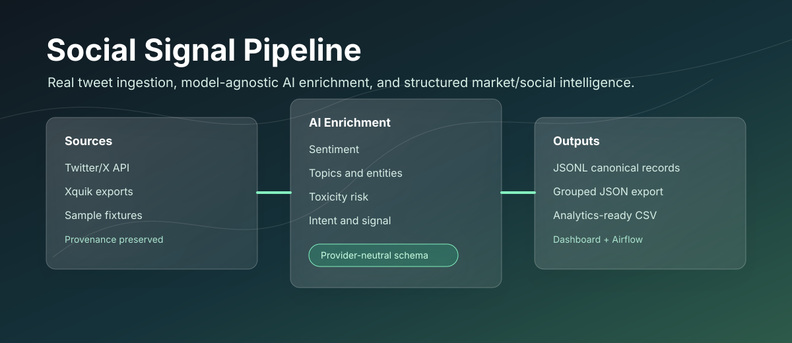
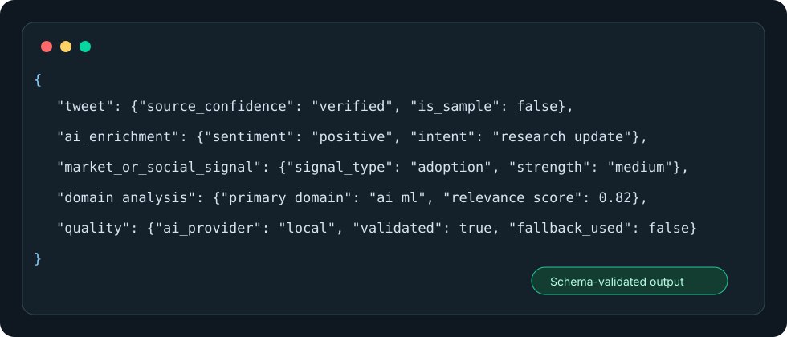
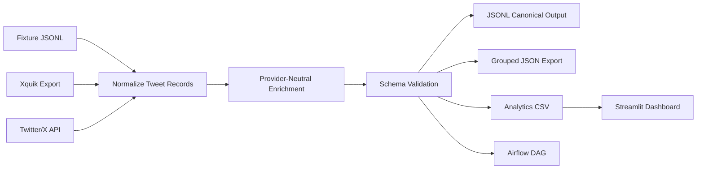

# Social Signal Pipeline

[](https://github.com/askmy-stack/social-signal-pipeline/actions/workflows/ci.yml)
[](LICENSE)
[](https://www.python.org/)
[](https://airflow.apache.org/)
[](CONTRIBUTING.md)



Social Signal Pipeline turns real Twitter/X records into structured intelligence. It ingests tweets from fixture data, Xquik exports, or the Twitter/X API; preserves provenance; enriches every record with model-agnostic AI; and exports validated JSONL, grouped JSON, and analytics-ready CSV artifacts.

This project is designed as a portfolio-grade data engineering and AI enrichment system: easy to run locally without credentials, safe with real social data, and clear enough for contributors to extend with new connectors, providers, and analytics views.

## Why It Stands Out

- **Real data discipline:** tweet IDs, source URLs, author handles, metrics, connector names, confidence, and sample flags are preserved.
- **Model-agnostic AI:** use local deterministic rules, OpenAI-compatible APIs, local LLMs, Anthropic, Ollama, vLLM, LM Studio, Hugging Face, Together, Groq, or Fireworks.
- **Strict validation:** model output is treated as untrusted until it matches the enrichment schema.
- **Safe fallback:** malformed JSON, invalid enum values, unsupported provider output, and missing credentials fall back to local enrichment.
- **Portfolio-ready outputs:** JSONL for pipelines, grouped JSON for applications, CSV for BI/dashboarding, and Streamlit for visual exploration.
- **Open source friendly:** CI, issue templates, PR checklist, contributing guide, security policy, code of conduct, and changelog.

## Demo Preview



Run the no-credential demo and inspect generated artifacts:

```bash
export FIXTURE_TWEETS_PATH=examples/sample_tweets.jsonl
export AI_PROVIDER=local
export AI_ENRICHMENT_MODE=local
export OUTPUT_CSV_PATH=outputs/refined_tweets.csv
export OUTPUT_JSONL_PATH=outputs/enriched_tweets.jsonl
export OUTPUT_JSON_PATH=outputs/enriched_tweets.json
python -c "from twitter_etl import run_twitter_etl; print(run_twitter_etl())"
```

For a future repository media upgrade, record a short GIF showing the fixture run, generated JSONL, and Streamlit dashboard. Recommended filename: `docs/assets/demo.gif`.

## Architecture



## Technology Stack

| Layer | Tools |
|---|---|
| Language | Python 3.11+ |
| Orchestration | Apache Airflow |
| Data processing | pandas, DuckDB |
| Validation | Pydantic |
| AI providers | local rules, OpenAI-compatible APIs, Anthropic-compatible wrapper, Ollama, vLLM, LM Studio, Hugging Face, Together, Groq, Fireworks |
| Dashboard | Streamlit, Plotly |
| Streaming extension | Tweepy filtered stream, Kafka producer |
| CI | GitHub Actions |

## Quick Start

```bash
git clone https://github.com/askmy-stack/social-signal-pipeline.git
cd social-signal-pipeline
python -m venv .venv
source .venv/bin/activate
pip install --upgrade pip
pip install -r requirements.txt
```

Run the fixture pipeline:

```bash
export FIXTURE_TWEETS_PATH=examples/sample_tweets.jsonl
export AI_PROVIDER=local
export AI_ENRICHMENT_MODE=local
export OUTPUT_CSV_PATH=outputs/refined_tweets.csv
export OUTPUT_JSONL_PATH=outputs/enriched_tweets.jsonl
export OUTPUT_JSON_PATH=outputs/enriched_tweets.json
python -c "from twitter_etl import run_twitter_etl; print(run_twitter_etl())"
```

Validate the repository:

```bash
python -m py_compile twitter_etl.py twitter_dag.py dashboard.py streaming/twitter_stream.py
PYTHONPATH=. pytest tests/ -q
```

## Source Configuration

Use fixture data for local demos:

```bash
export FIXTURE_TWEETS_PATH=examples/sample_tweets.jsonl
```

Use Xquik exports:

```bash
export XQUIK_TWEETS_PATH=exports/xquik-tweets.jsonl
```

Use Twitter/X API fallback when no fixture or Xquik path is set:

```bash
export TWITTER_CONSUMER_KEY=...
export TWITTER_CONSUMER_SECRET=...
export TWITTER_ACCESS_TOKEN=...
export TWITTER_ACCESS_SECRET=...
export TWITTER_SCREEN_NAME=@example
export TWITTER_MAX_COUNT=200
```

Fixture records are always exported with `"is_sample": true` and `"source_confidence": "sample"`.

## AI Provider Configuration

Default local mode:

```bash
export AI_PROVIDER=local
export AI_ENRICHMENT_MODE=local
export AI_MODEL=local-rule-enricher-v1
```

Local open source model through Ollama:

```bash
export AI_PROVIDER=ollama
export AI_ENRICHMENT_MODE=local_llm
export AI_MODEL=llama3.1
export AI_BASE_URL=http://localhost:11434/v1
```

Hosted OpenAI-compatible endpoint:

```bash
export AI_PROVIDER=openai_compatible
export AI_ENRICHMENT_MODE=api
export AI_MODEL=provider/model-name
export AI_API_KEY=...
export AI_BASE_URL=https://api.provider.example/v1
```

Supported providers: `local`, `openai`, `anthropic`, `ollama`, `huggingface`, `vllm`, `lmstudio`, `together`, `groq`, `fireworks`, and `openai_compatible`.

Supported enrichment modes: `local`, `api`, `local_llm`, and `hybrid`.

## Output Schema

The canonical record contains four top-level sections:

```json
{
  "tweet": {
    "tweet_id": "string",
    "source_url": "string|null",
    "author_handle": "string",
    "text": "string",
    "source_connector": "twitter_api|xquik|fixture",
    "source_confidence": "verified|exported|sample",
    "is_sample": false
  },
  "ai_enrichment": {
    "sentiment": "positive|negative|neutral|mixed",
    "topics": ["string"],
    "entities": [],
    "summary": "string",
    "toxicity_risk": {"level": "none|low|medium|high", "score": 0.0, "reason": "string"},
    "intent": "news|opinion|research_update|product_update|market_commentary|hiring|funding|warning|question|announcement|other",
    "market_or_social_signal": {"signal_type": "none|bullish|bearish|adoption|risk|controversy|technical_breakthrough|funding|policy|infrastructure_shift", "strength": "low|medium|high", "rationale": "string"}
  },
  "domain_analysis": {
    "primary_domain": "technology|ai_ml|research|infrastructure|finance|cybersecurity|cloud|semiconductors|crypto|policy|energy|healthcare|education|other",
    "secondary_domains": ["string"],
    "correlated_domains": [],
    "relevance_score": 0.0
  },
  "quality": {
    "schema_version": "1.0",
    "ai_provider": "local",
    "ai_model": "local-rule-enricher-v1",
    "enrichment_mode": "local",
    "fallback_used": false,
    "validated": true,
    "requires_human_review": false
  }
}
```

Artifacts:

- `outputs/enriched_tweets.jsonl`: canonical one-record-per-line export
- `outputs/enriched_tweets.json`: grouped JSON with metadata
- `outputs/refined_tweets.csv`: flattened analytics export

## Dashboard

```bash
streamlit run dashboard.py
```

The dashboard prefers `outputs/enriched_tweets.jsonl` and falls back to `outputs/refined_tweets.csv`.

## Airflow

Install Airflow separately when you want orchestration:

```bash
pip install apache-airflow
export AIRFLOW_HOME=$(pwd)/airflow
airflow db migrate
airflow standalone
```

Then place or mount the repository as an Airflow DAG folder and trigger `twitter_dag`.

## Docker

```bash
cp .env.example .env
docker compose up -d
```

Services:

- Airflow webserver: `http://localhost:8080`
- Streamlit dashboard: `http://localhost:8501`
- Kafka broker: `localhost:9092`

## Project Structure

```text
.
├── .github/                  # CI, issue templates, PR template
├── docs/assets/              # README visuals
├── examples/                 # Safe sample tweet fixtures
├── streaming/                # Optional Twitter/X filtered-stream producer
├── tests/                    # Unit and regression tests
├── dashboard.py              # Streamlit analytics dashboard
├── docker-compose.yml        # Local Airflow + Kafka + dashboard stack
├── twitter_dag.py            # Airflow DAG entrypoint
├── twitter_etl.py            # Ingestion, normalization, enrichment, validation, exports
├── CONTRIBUTING.md
├── SECURITY.md
├── CODE_OF_CONDUCT.md
└── CHANGELOG.md
```

## Roadmap

- Split `twitter_etl.py` into focused ingestion, provider, schema, and export modules.
- Add an Airflow 2 TaskFlow DAG with explicit extract, enrich, validate, and export tasks.
- Add semantic search with embeddings and a local vector index.
- Add connector adapters for additional social and news sources.
- Add a persisted DuckDB analytics layer.
- Add release automation and versioned schema migration notes.
- Publish a short dashboard GIF in `docs/assets/demo.gif`.

## Production Readiness Notes

Current strengths:

- no credentials required for local demo or CI
- sample data cannot be exported as verified real tweets
- untrusted model output is schema validated
- unsupported model output falls back safely
- generated outputs and private exports are ignored by git

Known next hardening steps:

- split the main ETL module for long-term maintainability
- add structured logging and retry policy around live API calls
- add rate-limit/backoff tests for Twitter/X ingestion
- add deployment-specific secret management documentation
- add release tags once the public API stabilizes

## Contributing

Contributions are welcome. Good first areas:

- new source connectors
- new AI provider adapters
- dashboard views
- schema validation tests
- documentation and examples

Please read [CONTRIBUTING.md](CONTRIBUTING.md), follow the [Code of Conduct](CODE_OF_CONDUCT.md), and preserve tweet provenance in every change.

## Security

Do not commit `.env`, credentials, private exports, or generated output files. See [SECURITY.md](SECURITY.md) for vulnerability reporting and data safety expectations.

## License

This project is licensed under the [MIT License](LICENSE).

## Contact

Maintained by [askmy-stack](https://github.com/askmy-stack). Open an issue or pull request for questions, ideas, and improvements.
